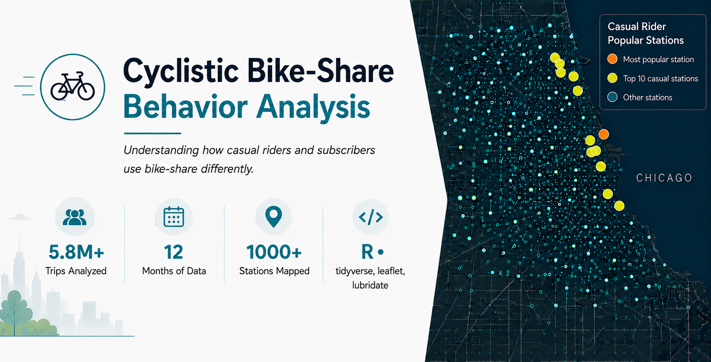
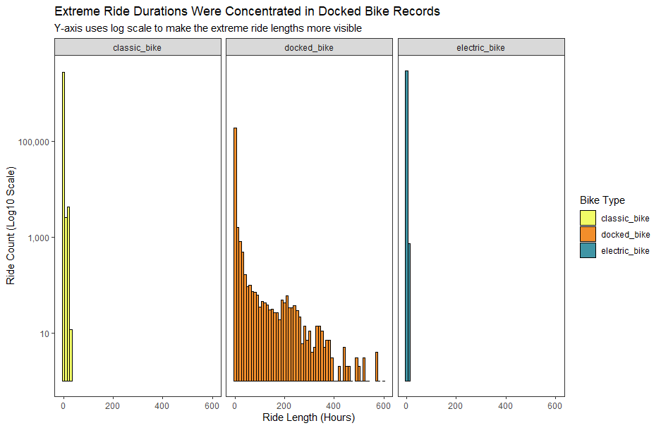
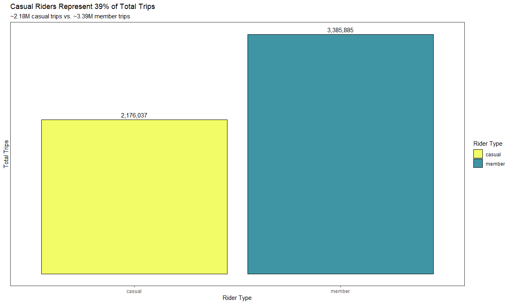
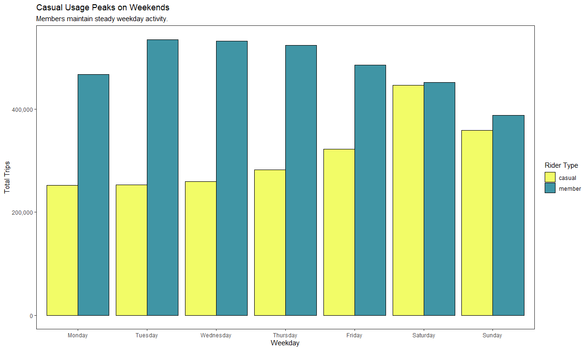
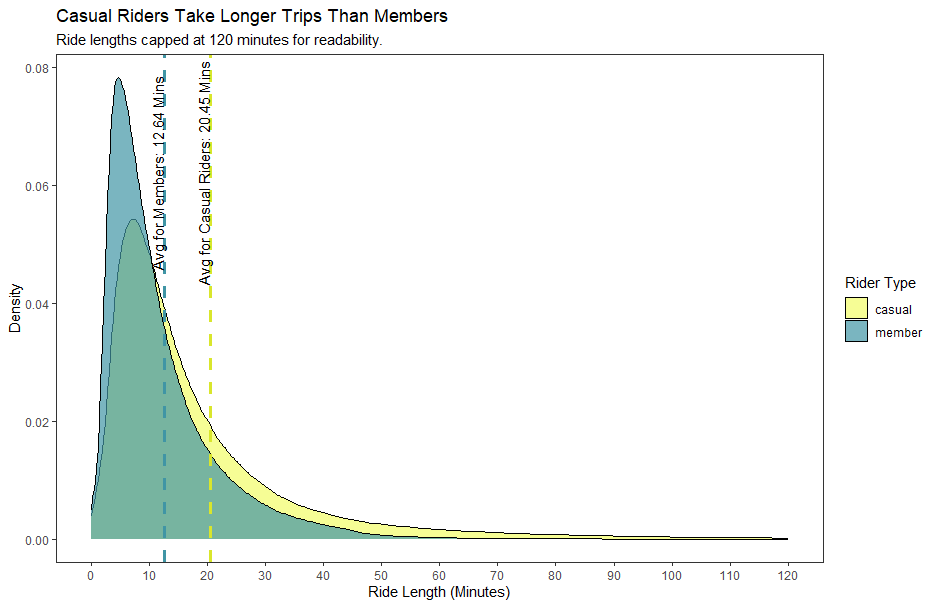
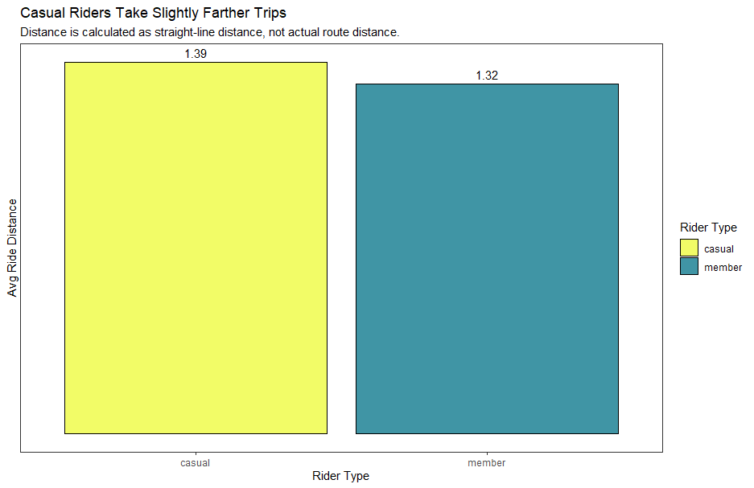
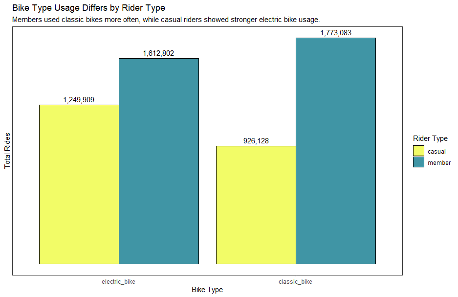
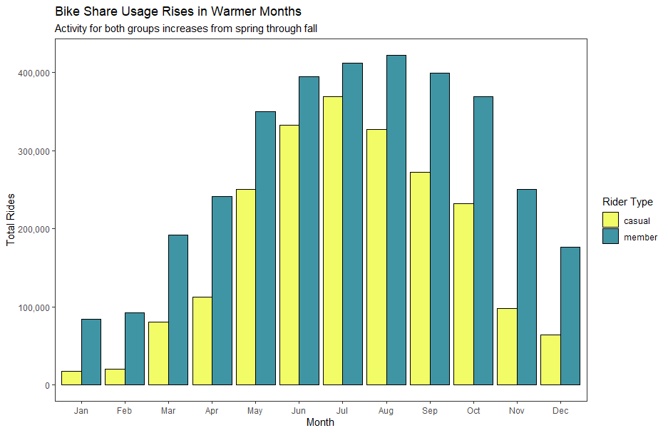
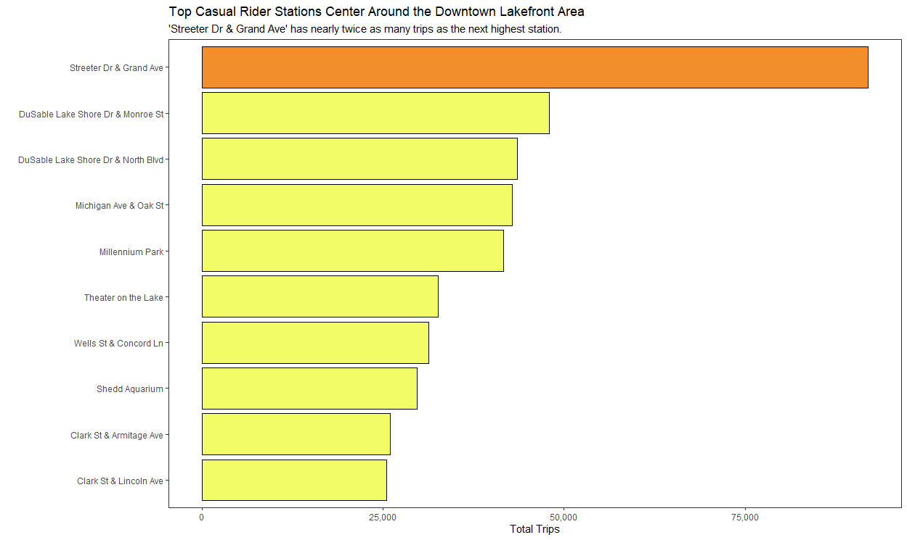
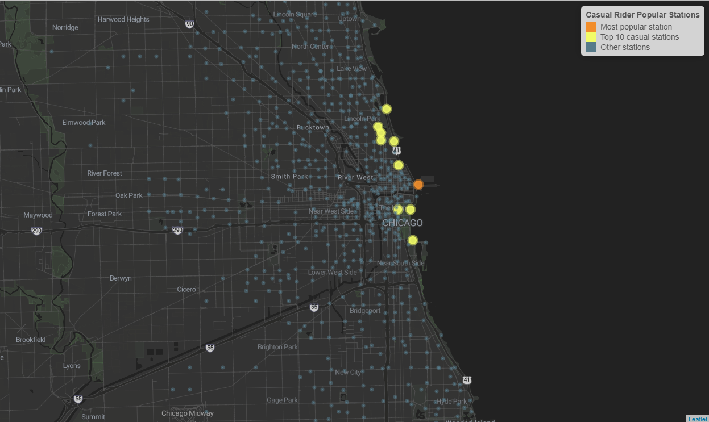

# Bike Share Behavior Analysis



This analysis used 5.8M+ Chicago bike-share trips to compare how casual riders and members use the service. The goal was to uncover behavior patterns that could support better membership conversion strategies.

> **Business Question:** How do casual riders and members behave differently, and how can Cyclistic convert more casual riders into members?

> **Quick Summary:** Casual riders behave more recreationally, especially around weekends, warmer months, longer rides, higher electric bike usage, and higher use of lakefront/downtown stations. This suggests Cyclistic should target recreational casual riders with seasonal or weekend focused membership offers in popular casual zones, then test whether those offers increase conversion.


## Project Highlights
- Analyzed and cleaned 5.8M+ bike-share trips in R.
- Recovered 205k+ missing start station IDs and 216k+ missing end station IDs using coordinate matching.
- Investigated abnormal ride length distribution and filtered 266k unreliable rows to improve data quality.
- Calculated straight-line ride distance using the Haversine formula.
- Built visuals to compare ride volume, duration, distance, seasonality, bike type, and station usage.


## Data & Tools
The analysis is based on **Cyclistic’s** CSV trip data, which can be accessed within the [data folder](data) of this repo.

- **R**: For data wrangling, analysis, and visualization
- **RStudio**: Primary environment used for scripting
- **renv**: R package management for reproducibility
- **Git/GitHub**: Version control and project documentation


## Data Quality Decisions
The raw trip data contained a few issues that could alter the analysis, especially station level rankings and ride duration comparisons.


| Data Quality Issues                   |   Count |
| ------------------------------------- | ------: |
| Missing Station Names                 | 958,227 |
| Missing Station IDs                   | 958,227 |
| Zero-distance rides under 60 seconds  |  71,521 |
| Stations missing coordinates/distance |   5,844 |
| Negative/Zero ride duration           |     571 |
| Test station trip                     |       1 |


### Station recovery
To improve the station level analysis, I built a coordinate-based station lookup using known station IDs, station names, and latitude/longitude pairs.

To avoid false matches, I only used coordinate pairs that mapped to one unique station ID. Coordinate pairs tied to multiple station IDs were excluded from the recovery process.


| Field              | Missing Before | Missing After | Recovered |
| ------------------ | -------------: | ------------: | --------: |
| Start Station ID   |        895,032 |       689,443 |   205,589 |
| Start Station Name |        895,032 |       689,443 |   205,589 |
| End Station ID     |        958,227 |       742,075 |   216,152 |
| End Station Name   |        958,227 |       742,075 |   216,152 |

<details>
<summary>Click to view code</summary>

``` r
# Creating/combining start and end station lists to create a full list
# Avoid making additional df to minimize space
full_station_list <- bind_rows(all_trips %>%
    select(
      station_id = start_station_id,
      station_name = start_station_name,
      lat = start_lat,
      lng = start_lng
    ),
  all_trips %>% 
    select(
      station_id = end_station_id,
      station_name = end_station_name,
      lat = end_lat,
      lng = end_lng
    )) %>% 
  filter(
    !is.na(station_id),
    !is.na(station_name),
    !is.na(lat),
    !is.na(lng)) %>%
  distinct()


# Creating a station list with coordinates that have one instance
valid_coordinates <- full_station_list %>%
  distinct(lat, lng, station_id) %>%
  count(lat, lng, name = "station_count") %>%
  filter(station_count == 1) %>%
  select(lat, lng)

full_station_list <- full_station_list %>%
  inner_join(valid_coordinates, by = c("lat", "lng")) %>%
  distinct(lat, lng, .keep_all = T)


# Join start stations, making a new df
all_trips2 <- left_join(all_trips, full_station_list,
                        by = c("start_lat" = "lat",
                               "start_lng" = "lng"))


all_trips2 <- all_trips2 %>%
  mutate(start_station_name = coalesce(start_station_name, station_name),
         start_station_id = coalesce(start_station_id, station_id)) %>% 
  select(-station_name, -station_id)


# Join end stations
all_trips2 <- left_join(all_trips2, full_station_list,
                        by = c("end_lat" = "lat", "end_lng" = "lng"))

all_trips2 <- all_trips2 %>% 
  mutate(end_station_name = coalesce(end_station_name, station_name),
         end_station_id = coalesce(end_station_id, station_id)) %>% 
  select(-station_name, -station_id)


# Compare missing station values before and after coordinate-based recovery
station_recovery_summary <- tibble(
  field = c("Start Station ID", "Start Station Name", "End Station ID", "End Station Name"),
  missing_before = c(
    sum(is.na(all_trips$start_station_id)),
    sum(is.na(all_trips$start_station_name)),
    sum(is.na(all_trips$end_station_id)),
    sum(is.na(all_trips$end_station_name))
  ),
  missing_after = c(
    sum(is.na(all_trips2$start_station_id)),
    sum(is.na(all_trips2$start_station_name)),
    sum(is.na(all_trips2$end_station_id)),
    sum(is.na(all_trips2$end_station_name))
  )
) %>%
  mutate(recovered = missing_before - missing_after)
```
</details>


### Station ID and Name Validation
A small number of station IDs were tied to multiple station name variants. These appeared to be naming variations rather than separate stations.

To avoid splitting the same station across multiple labels, station popularity was grouped by `station_id`. This made the station ranking more reliable because the analysis used stable station IDs to group by.

<details>
<summary>Click to view code</summary>

``` r
station_name_instances <- bind_rows(
  all_trips2 %>%
    transmute(station_id = start_station_id, station_name = start_station_name),
  all_trips2 %>%
    transmute(station_id = end_station_id, station_name = end_station_name)
) %>%
  filter(!is.na(station_id), !is.na(station_name)) %>%
  distinct(station_id, station_name) %>%
  count(station_id, name = "name_count") %>%
  filter(name_count > 1) %>%
  arrange(desc(name_count))

```
</details>

### Docked bike records distorted ride duration
Ride duration contained extreme outliers, including a maximum trip length of over 666 hours. These values were not realistic for normal rider behavior and would distort ride duration comparisons.

|     Min. | 1st Qu. | Median |  Mean | 3rd Qu. |      Max. |
| -------: | ------: | -----: | ----: | ------: | --------: |
| -621,201 |     356 |    629 | 1,176 |   1,131 | 2,442,301 |


These outliers are especially clear in the fourth quartile:

|      80% |      85% |      90% |      95% |      99% |     99.8% |     99.9% |         100% |
| -------: | -------: | -------: | -------: | -------: | --------: | --------: | -----------: |
| 1,313.00 | 1,564.00 | 1,950.00 | 2,759.00 | 6,490.00 | 17,975.66 | 73,080.96 | 2,442,301.00 |


The extreme ride durations were concentrated in docked bike records. Because of this, I excluded those records to prevent the outliers from distorting the analysis.



<details>
<summary>Click to view code</summary>

``` r
# Plotting histogram: Ride length distribution by bike type
# Used log scale to show the dist of the ride lengths clearer
ride_length_hist_plot <- ggplot(all_trips2 %>%
    filter(
      !is.na(ride_length_sec),
      is.finite(ride_length_sec),
      ride_length_sec > 0,
      ride_length_sec / 3600 <= 600
      ),
  aes(x = ride_length_sec / 3600, fill = rideable_type)) +
  geom_histogram(binwidth = 10, color = "black") +
  facet_wrap(~rideable_type) +
  scale_y_log10(labels = scales::comma_format()) +
  labs(
    title = "Extreme Ride Durations Were Concentrated in Docked Bike Records",
    subtitle = "Y-axis uses log scale to make the extreme ride lengths more visible",
    x = "Ride Length (Hours)",
    y = "Ride Count (Log10 Scale)",
    fill = "Bike Type"
  ) +
  scale_fill_manual(values = c("classic_bike" = "#F2FC67", "electric_bike" = "#4095A5", "docked_bike" = "#F28E2B"))

ride_length_hist_plot

```
</details>


## Key Findings

### Casual riders are a large portion of the conversion pool

Casual riders make up a large portion of all trips, making targeted conversion efforts worth exploring.



<details>
<summary>Click to view code</summary>

``` r
# Plotting bar chart: Total rides by rider Type
total_rides_plot <- ggplot(member_summary, aes(x = member_casual, y = total_rides, fill = member_casual)) +
  geom_col(color = "black") +
  geom_text(aes(label = scales::comma(total_rides)), vjust = -0.5) +
  labs(
    title = "Casual Riders Represent 39% of Total Trips",
    subtitle = "~2.18M casual trips vs. ~3.39M member trips",
    x = "Rider Type",
    y = "Total Trips",
    fill = "Rider Type"
  ) +
  scale_y_continuous(labels = scales::comma_format()) +
  scale_fill_manual(values = c("casual" = "#F2FC67", "member" = "#4095A5")) +
  theme(axis.text.y = element_blank(), axis.ticks.y = element_blank())

total_rides_plot
```
</details>

### Casual riders behave more recreationally

Casual riders show stronger weekend activity, longer ride durations, and only slightly farther average distances. This pattern suggests casual riders are using bikes for more recreational trips, while members show steadier routine usage throughout the week.



<details>
<summary>Click to view code</summary>

``` r
# Plotting bar chart: Weekly total rides by rider type
weekly_trip_count_plot <- ggplot(weekday_summary, aes(x = weekday, y = total_rides, fill = member_casual)) +
  geom_col(color = "black", position = "dodge") +
  labs(
    title = "Casual Usage Peaks on Weekends",
    subtitle = "Members maintain steady weekday activity.",
    x = "Weekday",
    y = "Total Trips",
    fill = "Rider Type"
  ) +
  scale_y_continuous(labels = scales::comma_format()) +
  scale_fill_manual(values = c("casual" = "#F2FC67", "member" = "#4095A5"))

weekly_trip_count_plot
```
</details>



<details>
<summary>Click to view code</summary>

``` r
# Plotting density chart: Ride length by rider type
member_avg_ride <- member_summary$avg_ride_length_min[member_summary$member_casual == "member"]
casual_avg_ride <- member_summary$avg_ride_length_min[member_summary$member_casual == "casual"]


density_trip_length_plot <- ggplot(all_trips2 %>%
         filter((ride_length_sec / 60) <= 120),
       aes(x = ride_length_sec / 60, fill = member_casual)) +
  geom_density(alpha = 0.7) +
  geom_vline(xintercept = member_avg_ride, linetype = "dashed", color = "#4095A5", linewidth = 1.2) +
  geom_vline(xintercept = casual_avg_ride, linetype = "dashed",color = "#D9E62C", linewidth = 1.2) +
  annotate(
    "text", x = member_avg_ride - 1.2, y = 0.062,
    label = paste("Avg for Members:", round(member_avg_ride, 2), "Mins"),
    angle = 90, 
    color = "black"
    ) +
  annotate(
    "text", x = casual_avg_ride - 1.2, y = 0.062,
    label = paste("Avg for Casual Riders:", round(casual_avg_ride, 2), "Mins"),
    angle = 90,
    color = "black"
    ) +
  labs(
    title = "Casual Riders Take Longer Trips Than Members",
    subtitle = "Ride lengths capped at 120 minutes for readability.",
    x = "Ride Length (Minutes)",
    y = "Density",
    fill = "Rider Type"
  ) +
  scale_x_continuous(breaks = seq(0, 120, by = 10)) +
  scale_fill_manual(values = c("casual" = "#F2FC67", "member" = "#4095A5"))

density_trip_length_plot
```
</details>



<details>
<summary>Click to view code</summary>

``` r
# Plotting bar chart: Average ride distance by rider type
trip_distance_plot <- ggplot(member_summary, aes(x = member_casual, y = avg_distance_miles, fill = member_casual)) +
  geom_col(color = "black") +
  geom_text(aes(label = round(avg_distance_miles, 2)), vjust = -0.5) +
  labs(
    title = "Average Trip Distance Is Similar Between Rider Types",
    subtitle = "Distance is calculated as straight-line distance, not actual route distance.",
    x = "Rider Type",
    y = "Avg Trip Distance",
    fill = "Rider Type"
  ) +
  scale_fill_manual(values = c("casual" = "#F2FC67", "member" = "#4095A5")) +
  theme(axis.text.y = element_blank(), axis.ticks.y = element_blank())

trip_distance_plot
```
</details>

### Electric bikes represent a larger share of casual rider activity

Electric bikes made up a larger portion of casual rider trips than member trips. This suggests electric bike access may be an attractive part of the casual experience and could be worth considering when creating targeted offers.




<details>
<summary>Click to view code</summary>

``` r
# Plotting bar chart: Bike type usage by rider type
bike_type_plot <- ggplot(bike_type_summary, aes(x = rideable_type, y = pct_rides, fill = member_casual)) +
  geom_col(color = "black") +
  geom_text(aes(label = scales::percent(pct_rides)), vjust = -0.5) +
  facet_wrap(~member_casual) +
  labs(
    title = "Electric Bikes Are a Larger Share of Casual Rider Trips",
    subtitle = "Bike types are shown as a percentage of trips for each rider type.",
    x = "Bike Type",
    y = "Share of Trips",
    fill = "Rider Type"
  ) +
  scale_y_continuous(limits = c(0, 1)) +
  scale_fill_manual(values = c("casual" = "#F2FC67", "member" = "#4095A5")) +
  theme(axis.text.y = element_blank(), axis.ticks.y = element_blank(), legend.position = "none")

bike_type_plot
```
</details>


### Casual activity is seasonal

Casual rider volume rises sharply from spring through summer, creating an opportunity for seasonal conversion campaigns.



<details>
<summary>Click to view code</summary>

``` r
# Plotting bar chart: Monthly total rides by rider type
monthly_trip_count_plot <- ggplot(month_summary, aes(x = month, y = total_rides, fill = member_casual)) +
  geom_col(color = "black", position = "dodge") +
  labs(
    title = "Casual Rider Activity Peaks in Warmer Months",
    subtitle = "Casual trips rise sharply from spring through summer",
    x = "Month",
    y = "Total Trips",
    fill = "Rider Type"
  ) +
  scale_y_continuous(labels = scales::comma_format()) +
  scale_fill_manual(values = c("casual" = "#F2FC67", "member" = "#4095A5"))

monthly_trip_count_plot
```
</details>


### Casual demand is geographically concentrated
The highest casual station activity clusters around areas near the downtown lakefront, suggesting that conversion efforts should focus on these areas instead of being citywide.



<details>
<summary>Click to view code</summary>

``` r
# Plotting bar chart: Top casual rider stations
popular_stations_plot <- ggplot(popular_stations, aes(x = reorder(station_name, total_rides), y = total_rides, fill = is_top_station)) +
  geom_col(color = "black") +
  coord_flip() +
  labs(
    title = "Top Casual Rider Stations Center Around the Downtown Lakefront Area",
    subtitle = "'Streeter Dr & Grand Ave' has nearly twice as many trips as the next highest station.",
    x = "",
    y = "Total Trips"
  ) +
  scale_y_continuous(labels = scales::comma_format()) +
  scale_fill_manual(values = c("TRUE" = "#F28E2B", "FALSE" = "#F2FC67")) +
  theme(legend.position = "none")

popular_stations_plot
```
</details>



<details>
<summary>Click to view code</summary>

``` r
# Popular station map
# Uses case_when to map colors to the image
stations_map_highlight <- leaflet(map_station_list, options = leafletOptions(zoomControl = F)) %>%
  addProviderTiles(provider = "Stadia.AlidadeSmoothDark", options = providerTileOptions(attribution = "")) %>%
  setView(lng = -87.65, lat = 41.88, zoom = 11.7) %>%
  addCircleMarkers(
    lng = ~lng,
    lat = ~lat,
    popup = ~paste("Station Name:", station_name),
    radius = ~case_when(is_top_station ~ 7, is_popular ~ 7, T ~ 1),
    color = ~case_when(is_top_station ~ "#F28E2B", is_popular ~ "#F2FC67", T ~ "#577B8A"),
    fillOpacity = .9
  ) %>% 
  addLegend(
    position = "topright",
    colors = c("#F28E2B", "#F2FC67", "#577B8A"),
    labels = c("Most popular station", "Top 10 casual stations", "Other stations"),
    title = "Casual Rider Popular Stations",
    opacity = 1
  )

# The snapshot used in the README was exported manually from the Viewer.
stations_map_highlight
```
</details>


## Recommendations

### 1. Target casual riders near lakefront and downtown stations

Casual rider activity is clearly concentrated around the lakefront and downtown stations. Conversion campaigns should focus on these areas during high activity months instead of spreading marketing evenly across all stations.


### 2. Launch seasonal campaigns before peak demand

Ride volume rises sharply during warmer months. Campaigns should begin in spring, before the casual rider peak so the memberships can feel useful before their riding season.


### 3. Test weekend-to-member conversion offers

Casual riders show more activity during the weekend. A weekend pass could help convert casual users by giving them another option before purchasing an annual membership.


### 4. Improve electric bike availability at casual-heavy stations

Electric bikes represent a larger portion of casual rider activity. Increasing access to electric bikes at popular stations could support the leisure based experience they are seeking.


## Reproducibility

This project uses `renv` to manage R package versions, making the analysis easier to reproduce.

The raw trip data is included in the repo as three `.zip` files. Before running the analysis, extract the files into the `data/trip_data/` folder.

To recreate the package environment, run:

```r
install.packages("renv")
renv::restore()
```